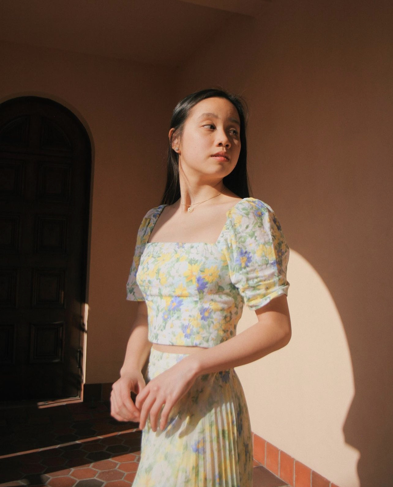
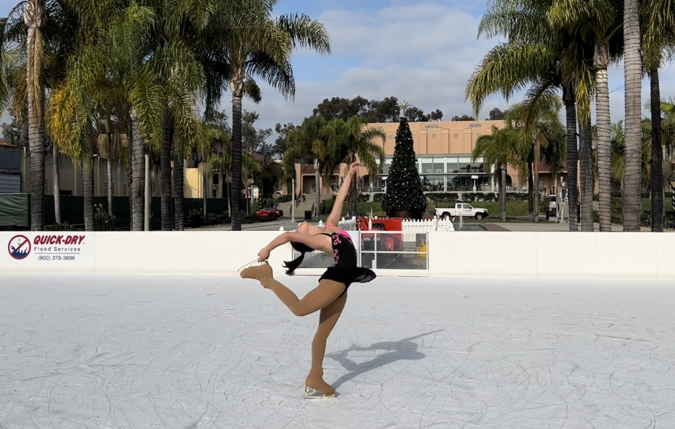

# Annie Phan 
Hello, my name is Annie and I am currently a 2nd year computer science major at UCSD. In my free time, I enjoy
- Figure skating
- Playing violin
- Hanging out with friends
- Hiking
- Eating out


> Photo from a day out

## Coding
My love for coding
I also **love** coding. Similar to others, one of my first ever lines of code was: 
```
System.out.println("Hello World!");
```
This sparked my interest in coding because I enjoyed how I was able to create something. It was something that I had never done before. 

In the past, I grew up surrounded by vintage computers. My dad used to collect computers and I remember playing with them early in my childhood.

In the upcoming years at UCSD, I hope to learn more about computer science and improve my technical skills.

To learn more about my background, click here: [˚ʚ♡ɞ˚](https://evotekwomenintech.org/annie-phan/)

## Outside Hobbies
In my free time, I enjoy figure skating, playing violin, and hanging out with friends. I skate almost everyday and it is an *amazing* stress reliever. I currently coach figure skating for students of all ages and abilities. It is one of my passions.

 
> Me skating at an outdoor ice rink to broadcast its annual opening

## My UCSD Experience
So far, I have been enjoying my UCSD experience. It is fun to meet new people and learn more about them. 

The quarter system does make everything feel a bit more fast paced. In order to stay in track, I have a daily to-do list which may look something like
- [x] Get ready for the day
- [x] Code
- [ ] Go to class
- [ ] Review Notes
- [ ] Finish HW

This daily to-do list has helped me stay productive and be a better student.

## My Future Plans
In the future, I hope to work in the tech industry after graduation. In order to reach this long-term goal, here is what I plan to do in order to get there:
1. Learn and do well in my CSE courses
2. Do outside projects and internships to gain technical experience
3. Make friends along the way and enjoy my UCSD experience
4. Apply for a job within the tech industry after graduation

I am excited for this upcoming quarter in CSE 110 and I can gain valuable experience that I can use elsewhere. 

## Other
[My Hopes for CSE 110](other.md)
